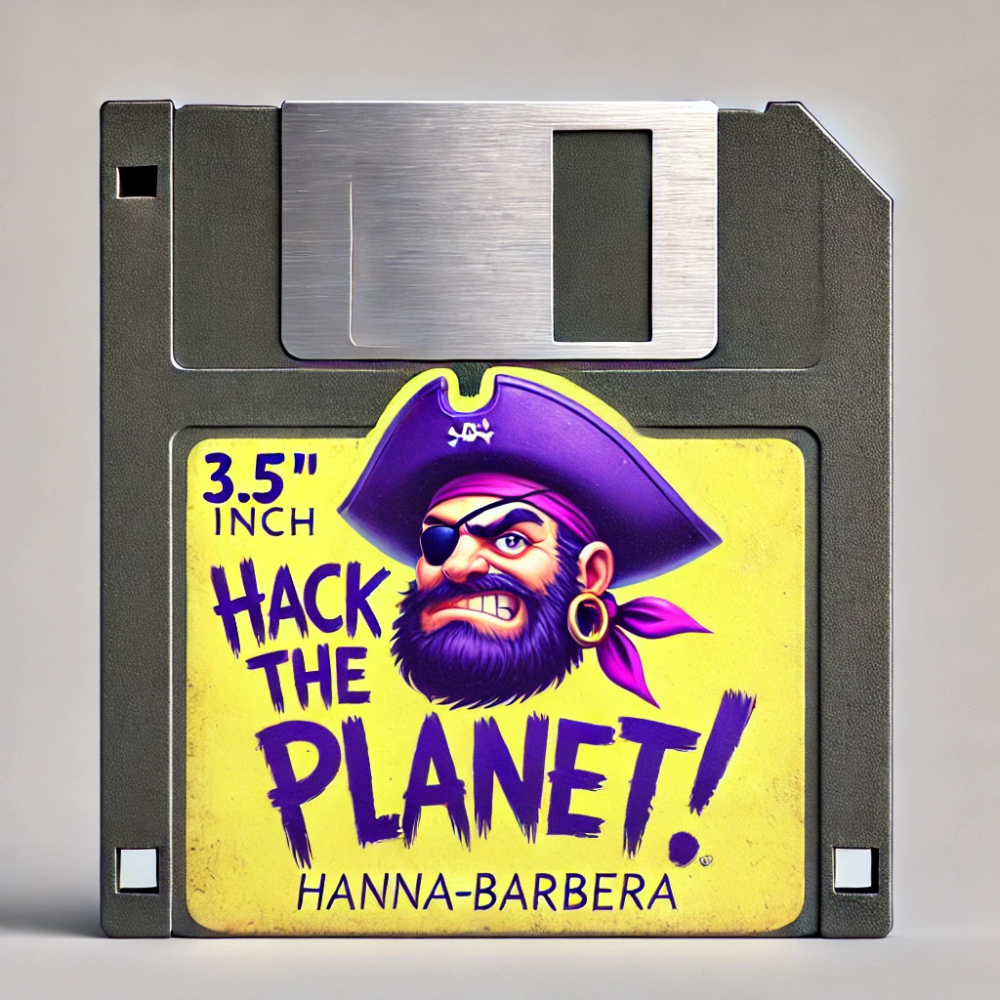
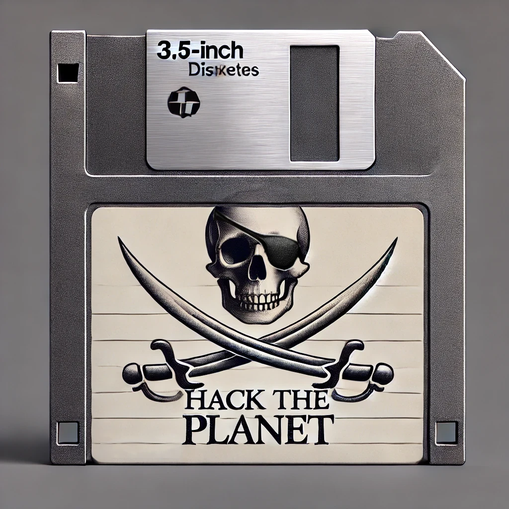
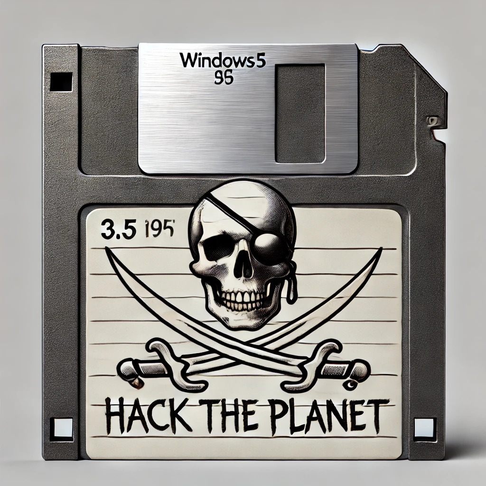
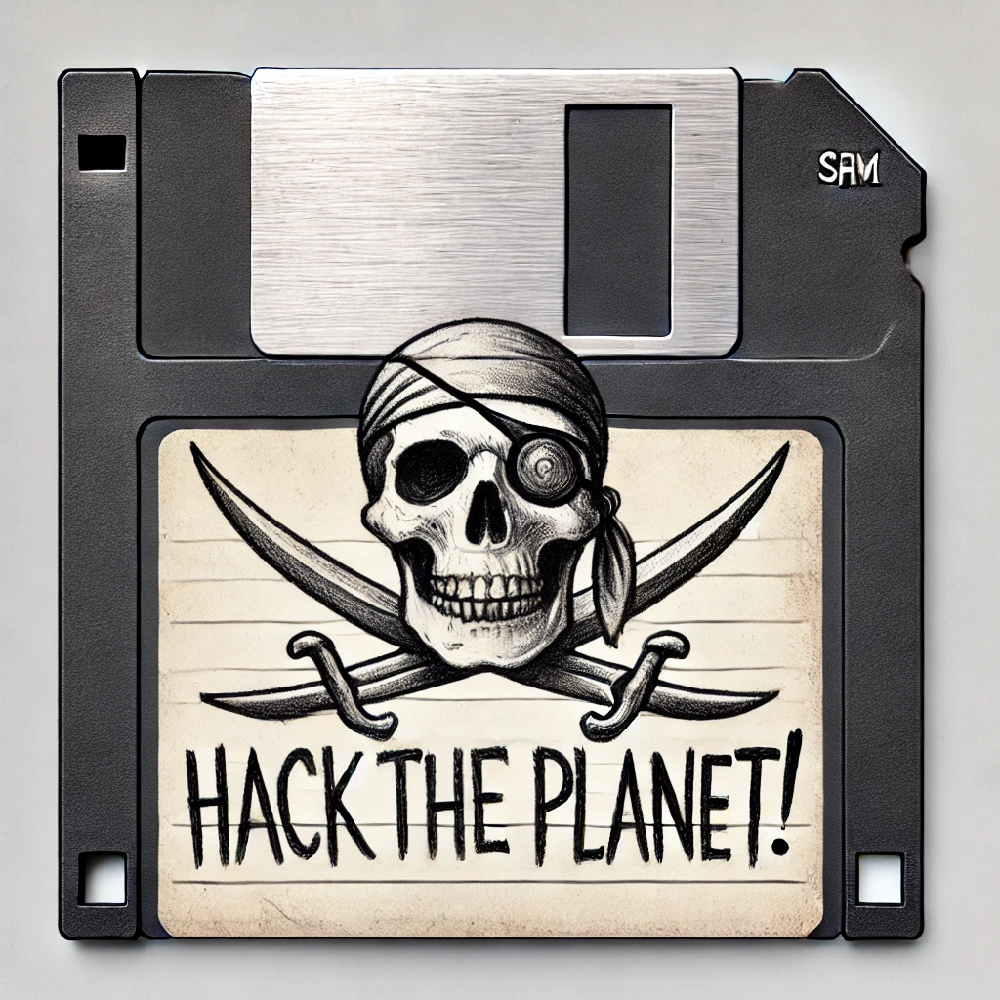
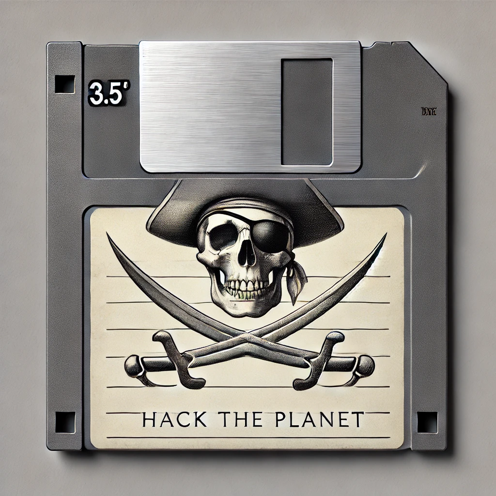
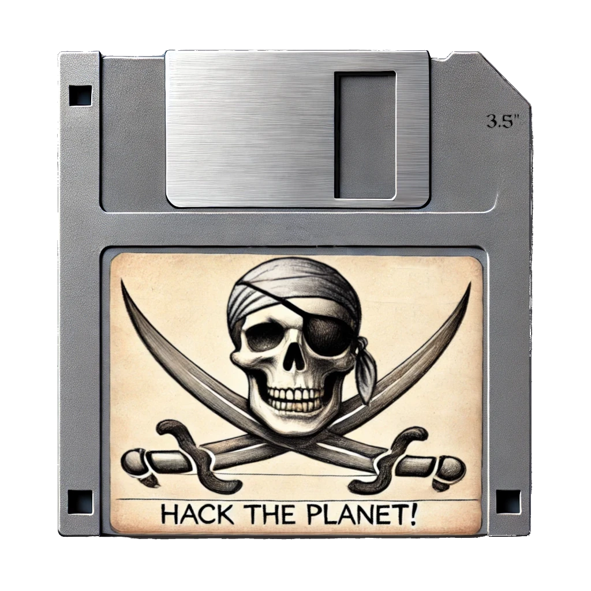

# Retro Labels

A Place To Store Labels, for floppies, minidiscs, cd-roms and others...

Turns out that sometimes we want to print or labels back to our own floppy
disks, MiniDiscs, CD-ROMs and others.  
This repository aims to be a central resource for storing and saving all labels,
and make it accessible to restore our nostalgia of printing and recreating it back
at any time.

- [Why Does this Exists?](README.md#motivation)
- [Image Gallery](README.md#image-gallery)
- [Contributing](README.md#contributing)
  - [Files Format](README.md#files-format)
  - [Artwork and Design Creating Tools](README.md#recommended-tools)
  - [The Retrolabels Structure](README.md#the-main-structure)
  - [Creating a new Project](README.md#creating-a-new-project)
- [Frequently Asked Questions](README.md#faq)
- [References and Links](README.md#references)

### Motivation

Sometime ago I've bought some Verbatim 3.5" floppy, and because those were old,
I was not able to use the original labels, since the glue was old and
does not work anymore. So I've decided to print back in a new sticker paper, in
order to have it as brand-new again. However! I haven't found any place were
to download the original labels. I didn't want a fake label, I want the
original, with the same brand, lines and colors, so I can write again my labels
manually as we do when we have a brand new floppies.

Since I haven't found those labels, I start to collect all diskette brands I
found and started to scan the labels, creating all the measurements to print,
and also writing back to me the instructions, so I can remember next time I have
to do it again.
I also have to save this work somewhere. So the retrolabels repository is born!

If you are like me, which still uses floppies in your retro PCs or are part of
retrocommunities and still want to revive your floppies or MiniDiscs with your
labels. This is a safe place were we can share those with every body.

Join me on, expanding this library of retrolabels.

This repository also accepts original handycraft labels, that you create to
your self and any artwork for reproducing your labels.  
For examples. lets say you're creating some nice MiniDisc label for the band
`Foo`, and you created some nice artwork. This is the place you can store and
share your original creations.

## Image Gallery

This section provides a comprehensive overview of all available images organized in tables for easy exploration. Each table shows the project name, diskette type, image preview, format, description, and pixel dimensions.

### Floppy Disk Labels

#### 3½-inch Floppy Disk Labels (fdd312)

| Project | Diskette Type | Preview | Image | Format | Description | Dimensions |
|---------|---------------|---------|-------|--------|-------------|------------|
| **diskclub** | 3½" |  | [diskclub-fdd312-all.svg](floppy/diskclub/fdd312/diskclub-fdd312-all.svg) | SVG | Complete diskclub label with all elements | 3094×2143 |
| **diskclub** | 3½" |  | [diskclub-label-smooth-pirate-black.svg](floppy/diskclub/fdd312/diskclub-label-smooth-pirate-black.svg) | SVG | Smooth pirate design with black background | 3094×2143 |
| **diskclub** | 3½" |  | [diskclub-fdd312-smooth-pirate.svg](floppy/diskclub/fdd312/diskclub-fdd312-smooth-pirate.svg) | SVG | Smooth pirate design variant | 3094×2143 |
| **diskclub** | 3½" |  | [diskclub-fdd312-bitmap-pirate.svg](floppy/diskclub/fdd312/diskclub-fdd312-bitmap-pirate.svg) | SVG | Bitmap-style pirate design | 3094×2143 |
| **diskclub** | 3½" |  | [diskclub-tests.svg](floppy/diskclub/fdd312/diskclub-tests.svg) | SVG | Test version of diskclub label | 794×1123 |
| **diskclub** | 3½" |  | [grey-floppy-layered-diskclub.png](floppy/diskclub/fdd312/grey-floppy-layered-diskclub.png) | PNG | Layered design on grey floppy background | 851×868 |
| **diskclub** | 3½" |  | [diskclub-smooth-pirate.png](floppy/diskclub/fdd312/diskclub-smooth-pirate.png) | PNG | Smooth pirate design raster version | 3094×2143 |
| **diskclub** | 3½" |  | [diskclub-bitmap-pirate.png](floppy/diskclub/fdd312/diskclub-bitmap-pirate.png) | PNG | Bitmap pirate design raster version | 3094×2143 |
| **hacktheplanet** | 3½" |  | [htp-purple-pirate.webp](floppy/hacktheplanet/fdd312/htp-purple-pirate.webp) | WebP | Purple pirate theme design | 1024×1024 |
| **hacktheplanet** | 3½" |  | [htp-v1.0.webp](floppy/hacktheplanet/fdd312/htp-v1.0.webp) | WebP | Version 1.0 of hacktheplanet label | 1024×1024 |
| **hacktheplanet** | 3½" |  | [htp-v2.0.webp](floppy/hacktheplanet/fdd312/htp-v2.0.webp) | WebP | Version 2.0 of hacktheplanet label | 1024×1024 |
| **hacktheplanet** | 3½" |  | [htp-v3.0.webp](floppy/hacktheplanet/fdd312/htp-v3.0.webp) | WebP | Version 3.0 of hacktheplanet label | 1024×1024 |
| **hacktheplanet** | 3½" |  | [htp-v4.0.webp](floppy/hacktheplanet/fdd312/htp-v4.0.webp) | WebP | Version 4.0 of hacktheplanet label | 1024×1024 |
| **hacktheplanet** | 3½" |  | [htp-v5.0.webp](floppy/hacktheplanet/fdd312/htp-v5.0.webp) | WebP | Version 5.0 of hacktheplanet label | 1024×1024 |
| **hacktheplanet** | 3½" |  | [htp-v6.0.webp](floppy/hacktheplanet/fdd312/htp-v6.0.webp) | WebP | Version 6.0 of hacktheplanet label | 1024×1024 |
| **hacktheplanet** | 3½" |  | [htp-v7.0.webp](floppy/hacktheplanet/fdd312/htp-v7.0.webp) | WebP | Version 7.0 of hacktheplanet label | 1024×1024 |
| **hacktheplanet** | 3½" |  | [htp-v8.0.webp](floppy/hacktheplanet/fdd312/htp-v8.0.webp) | WebP | Version 8.0 of hacktheplanet label | 1024×1024 |
| **hacktheplanet** | 3½" |  | [htp-v9.0.webp](floppy/hacktheplanet/fdd312/htp-v9.0.webp) | WebP | Version 9.0 of hacktheplanet label | 1024×1024 |
| **hacktheplanet** | 3½" |  | [htp-v10.0.webp](floppy/hacktheplanet/fdd312/htp-v10.0.webp) | WebP | Version 10.0 of hacktheplanet label | 1024×1024 |
| **hacktheplanet** | 3½" |  | [htp-v10.1.webp](floppy/hacktheplanet/fdd312/htp-v10.1.webp) | WebP | Version 10.1 of hacktheplanet label | 1024×1024 |
| **hacktheplanet** | 3½" |  | [htp-v10.2.webp](floppy/hacktheplanet/fdd312/htp-v10.2.webp) | WebP | Version 10.2 of hacktheplanet label | 1024×1024 |
| **hacktheplanet** | 3½" |  | [htp-v10.4.webp](floppy/hacktheplanet/fdd312/htp-v10.4.webp) | WebP | Version 10.4 of hacktheplanet label | 1024×1024 |
| **hacktheplanet** | 3½" |  | [label-only.png](floppy/hacktheplanet/fdd312/label-only.png) | PNG | Label design without background | 1024×1024 |
| **hacktheplanet** | 3½" |  | [pirate-only.png](floppy/hacktheplanet/fdd312/pirate-only.png) | PNG | Pirate design element only | 1024×1024 |
| **msdos** | 3½" |  | [Djhn9GP.jpeg](floppy/msdos/fd312/Djhn9GP.jpeg) | JPEG | MS-DOS floppy disk label | 2169×2250 |
| **msdos** | 3½" |  | [q3wgLA2.jpeg](floppy/msdos/fd312/q3wgLA2.jpeg) | JPEG | MS-DOS floppy disk label variant | 2202×2316 |
| **OldLabel** | 3½" |  | [old-label-floppy.webp](floppy/OldLabel/fdd312/old-label-floppy.webp) | WebP | Classic old floppy label design | 851×868 |
| **OldLabel** | 3½" |  | [old-label.png](floppy/OldLabel/fdd312/old-label.png) | PNG | Classic old floppy label raster version | 651×504 |

#### 5¼-inch Floppy Disk Labels (fdd514)

*Currently no 5¼-inch floppy disk labels available in the repository.*

### Original Scans and Source Files

#### 3½-inch Original Scans (fdd312)

| Project | Diskette Type | Preview | Image | Format | Description | Dimensions |
|---------|---------------|---------|-------|--------|-------------|------------|
| **originals** | 3½" |  | [grey-floppy-emptylabel.jpg](floppy/originals/fdd312/grey-floppy-emptylabel.jpg) | JPEG | Empty grey floppy disk for reference | 1024×768 |
| **originals** | 3½" |  | [grey-floppy-pirate.png](floppy/originals/fdd312/grey-floppy-pirate.png) | PNG | Grey floppy with pirate label | 512×512 |
| **originals** | 3½" |  | [grey-floppy-pirate-v1.1.jpg](floppy/originals/fdd312/grey-floppy-pirate-v1.1.jpg) | JPEG | Grey floppy pirate label v1.1 | 512×512 |
| **originals** | 3½" |  | [grey-floppy-pirate-v1.2.jpg](floppy/originals/fdd312/grey-floppy-pirate-v1.2.jpg) | JPEG | Grey floppy pirate label v1.2 | 512×512 |
| **originals** | 3½" |  | [pirate-label-v1.0.jpg](floppy/originals/fdd312/pirate-label-v1.0.jpg) | JPEG | Pirate label design v1.0 | 640×640 |
| **originals** | 3½" |  | [pirate-label-v1.1.jpg](floppy/originals/fdd312/pirate-label-v1.1.jpg) | JPEG | Pirate label design v1.1 | 640×640 |
| **originals** | 3½" |  | [pirate-label-v1.2.jpg](floppy/originals/fdd312/pirate-label-v1.2.jpg) | JPEG | Pirate label design v1.2 | 640×640 |
| **originals** | 3½" |  | [pirate-label-v1.3.jpg](floppy/originals/fdd312/pirate-label-v1.3.jpg) | JPEG | Pirate label design v1.3 | 640×640 |
| **originals** | 3½" |  | [pirate-label-v1.4.jpg](floppy/originals/fdd312/pirate-label-v1.4.jpg) | JPEG | Pirate label design v1.4 | 640×640 |
| **originals** | 3½" |  | [pirate-label-v1.5.jpg](floppy/originals/fdd312/pirate-label-v1.5.jpg) | JPEG | Pirate label design v1.5 | 640×640 |
| **originals** | 3½" |  | [pirate-label-v1.6.jpg](floppy/originals/fdd312/pirate-label-v1.6.jpg) | JPEG | Pirate label design v1.6 | 640×640 |
| **originals** | 3½" |  | [pirate-purple-v1.0.jpg](floppy/originals/fdd312/pirate-purple-v1.0.jpg) | JPEG | Purple pirate label v1.0 | 640×640 |
| **originals** | 3½" |  | [pirate-purple-v1.1.jpg](floppy/originals/fdd312/pirate-purple-v1.1.jpg) | JPEG | Purple pirate label v1.1 | 640×640 |
| **originals** | 3½" |  | [pirate-purple-v1.7.jpg](floppy/originals/fdd312/pirate-purple-v1.7.jpg) | JPEG | Purple pirate label v1.7 | 640×640 |
| **originals** | 3½" |  | [pirate-purple-v1.8.jpg](floppy/originals/fdd312/pirate-purple-v1.8.jpg) | JPEG | Purple pirate label v1.8 | 640×640 |
| **originals** | 3½" |  | [pirate-purple-v1.9.jpg](floppy/originals/fdd312/pirate-purple-v1.9.jpg) | JPEG | Purple pirate label v1.9 | 640×640 |

### Artwork Source Files

#### Vector Artwork (SVG/XCF)

| Project | Diskette Type | Preview | Image | Format | Description | Dimensions |
|---------|---------------|---------|-------|--------|-------------|------------|
| **diskclub** | 3½" |  | [bitmap-traced-pirate.svg](floppy/diskclub/art/bitmap-traced-pirate.svg) | SVG | Traced pirate bitmap artwork | 921×879 |
| **diskclub** | 3½" |  | [bitmap-traced-smooth-pirate.svg](floppy/diskclub/art/bitmap-traced-smooth-pirate.svg) | SVG | Smooth traced pirate artwork | 888×824 |
| **diskclub** | 3½" |  | [bitmap-traced-smooth-pirate-1.svg](floppy/diskclub/art/bitmap-traced-smooth-pirate-1.svg) | SVG | Smooth traced pirate artwork variant | 888×824 |
| **diskclub** | 3½" |  | [diskclub.svg](floppy/diskclub/art/diskclub.svg) | SVG | Main diskclub logo artwork | 904×1136 |
| **diskclub** | 3½" |  | [disk-clube-pirate-extracted.jpg](floppy/diskclub/art/disk-clube-pirate-extracted.jpg) | JPEG | Extracted pirate element | 1280×1263 |
| **diskclub** | 3½" |  | [diskclub-original.png](floppy/diskclub/original/diskclub-original.png) | PNG | Original diskclub scan | 478×226 |
| **diskclub** | 3½" |  | [diskclub-original.svg](floppy/diskclub/original/diskclub-original.svg) | SVG | Original diskclub vector version | 478×226 |
| **hacktheplanet** | 3½" |  | [htp-pirate-purple.svg](floppy/hacktheplanet/art/htp-pirate-purple.svg) | SVG | Purple pirate theme vector artwork | 558×432 |

### Fonts

| Project | Font File | Format | Description |
|---------|-----------|--------|-------------|
| **diskclub** | [Blockletter.otf](floppy/diskclub/fonts/Blockletter.otf) | OTF | Block letter font used in diskclub labels |

### Legend

- **Project**: The name of the label project/collection
- **Diskette Type**: 3½" (3.5-inch) or 5¼" (5.25-inch) floppy disk format
- **Preview**: Thumbnail preview of the image
- **Image**: Clickable link to view/download the image
- **Format**: File format (SVG, PNG, JPEG, WebP, XCF, OTF)
- **Description**: Brief description of the image content
- **Dimensions**: Image size in pixels (width × height)

### Notes

- **SVG files** are vector graphics suitable for scaling and editing
- **PNG/JPEG/WebP files** are raster images ready for printing
- **XCF files** are GIMP source files for editing
- **OTF files** are OpenType fonts used in the designs
- All images are organized by project and diskette type for easy navigation
- Image previews are automatically scaled by the browser for optimal viewing

## Contributing

Feel free to contribute with this project, please send all your artwork
versions.

This repository expects artworks for re-creating floppies, Mini-Discs, CD-ROM's and
other labels.

To contribute with a new label, start with:

1. Fork this project
2. Create your awesome new artworks
3. [Create a new project to your labels](README.md#creating-a-new-project)
4. Submit a Pull Request with your project or changes

### Files Format

Since the idea here is to keep all artwork open the only rule to contribute is
to provide the artworks saved with a open standard format. For example `.SVG`
files are very welcome.

With that the rule is, to always send back the artwork in a vectorial format
compatible with [inkscape](https://inkscape.org/) using `.svg` extension, or
[GIMP](https://gimp.org) using the `.xcf` extension. The artwork must be saved
in a `art` directory inside your labels project. [Read more on how to organize
your project here.](README.md#creating-a-new-project)

That means if you are using closed source proprietary tools such as:
"Photoshop, or any other Adobe Suite, or even CorelDraw" please make sure to
export the file to an open extension, so every one can contribute back with your
artwork.

For example:

One developing the artwork `foo.cdr` in CorelDraw can save the
`cdr` file in the `art` directory, but also the `foo.svg` file.

### Recommended Tools

This project does not mandate at all which tool you should or should not use.
Use whatever tool you have handy and have experience with. However for those who
does not have any, it's recommended to explore [GIMP](https://gimp.org) in favor of Adobe
Photoshop, and [Inkscape](https://inkscape.org) in favor of CorelDraw.

If you use closed tools such as Adobe Suite or CorelDraw, please make sure to
find a way to send the artwork files in a format that others who don't have access
for such tools can also contribute back.

For example:

One developing the artwork `foo.cdr` in CorelDraw can save the
`cdr` file in the `art` directory, but also the `foo.svg` file.

### Labels Structure

In order to have all labels organized this repository expects the files to
follow the same structure, which is the following:

#### The Main Structure

```bash
.
|- floppy
|- minidisc
|- cdrom
|- dvd
```

The main structure of this repository, is organized by the midia type. If you
are submitting floppies, start your structure inside the [floppy](floppy)
directory, in other hand if you're submitting MiniDiscs use the [minidisc](minidisc) directory instead.

#### Creating a new Project

When you create a new project, use the following structure:

```bash
./project-name
|- art
|- fdd312
|- fdd514
|- fonts
|- original
|- README.md
```

Where the those directories corresponds to:

- `project-name` - This is the directory name of your labels project.
  Example:  
   If you're creating labels for the Verbatim 3½-inch, your project can be
  named `verbatim`. Create it inside the main [floppy](floppy) directory.
  e.g:

  ```bash
  ./floppy/verbatim
  |- fdd312
  |- art
  ```

- `art` - This directory must be created inside your project directory, and it
  must have all the artwork you're creating. For example, `svg` and `xcf` files
  would be stored in this directory.

- `fdd312` - If the floppy diskette is a 3½-inch, the labels in final image format will
  be stored here. For example the `verbatim-label.png` file is the finished
  label file artwork ready to be printed.

- `fdd514` - This is to store the final image format ready to be printed, but
  for 5¼-inch floppies.

- `fonts` - Here you can store all fonts used in your artwork. This will
  simplify others to contribute with your project by using the properly fonts.

- `original` - All scanned and original copies of your labels, must be stored
  here. Example: The original scan copy of the Verbatim labels.

- `README.md` - The documentation of your project. Make sure to properly
  document your project, allowing other to understand how to use it. Include
  here, measurements and printing instructions on how to properly use your
  labels. Use the [`diskclub` README](floppy/diskclub/README.md) as template
  for it. Copy and adjust it to your project.

## FAQ

- Q: How can I contribute with labels?  
  A: Please jump into the [Contributing](README.md#contributing) session to know more.

- Q: Can I save the scan copies of my floppy labels?  
  A: Yes! Please do so! Scan your floppy disks and follow the [Contributing](README.md#contributing) guides, to upload your scans.

- Q: How can I print my label?  
  A: Download the label you want and follow the README in the label instructions
  to know how to recreate the size, and use the proper paper.

- Q: Can I submit only brand labels or can I submit my original labels?  
  A: Yes Please, send your original artwork, this repository is to store labels
  in general, not only brand labels, but also your manufactured original
  creations.

## References

While searching around I've also found some awesome references of people who did
a similar approach. Bellow I list some outstanding work out there regarding
labels, cover art and artwork archives:

- [The Sierra
  Chest](https://sierrachest.com/index.php?a=games&id=556&title=shadow-of-yserbius&fld=box&pid=2)
- [eXoDOS](https://www.retro-exo.com/exodos.html) also
  [here](https://the-eye.eu/public/Games/eXo/)
- [Moby Games DOS List](https://www.mobygames.com/platform/dos/)
- [sshake dos floppy
  labels](https://github.com/ssshake/windows311-dos622-floppy-disk-labels)
- [Nylan-1](https://github.com/NyLan-1/Floppy_Disk_Labels)
- [Andrew-Pollard](https://github.com/Andrew-Pollard/Floppy-Disk-Labels)
