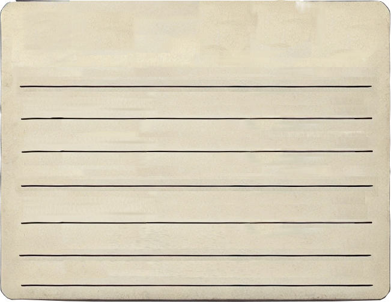
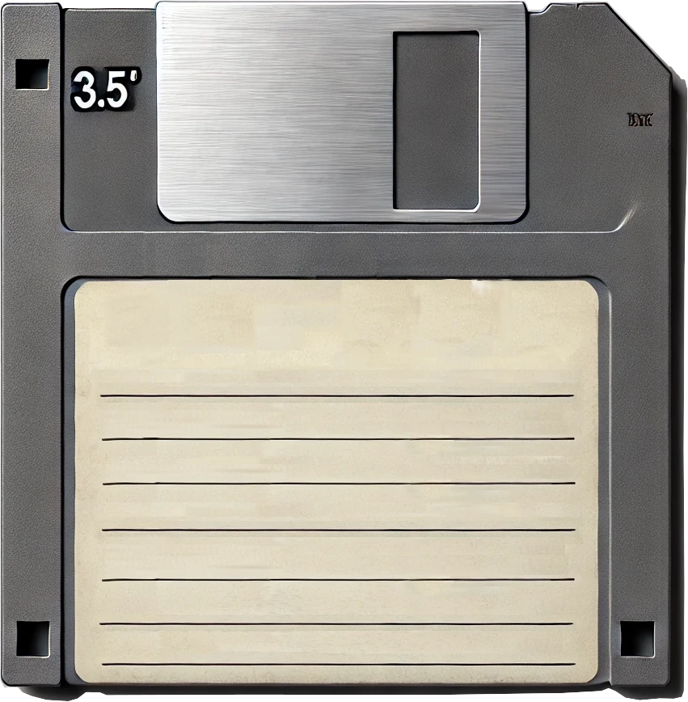

# OldLabel

These labels are intended to be printed so you can recreated a yellowish old
label for your floppies.

#### Artwork

All artwork was created with [inkscape](https://inkscape.org/) artwork files
will always be available as `.svg` in the [art directory](art). In additional
some `.xcf` files are also available to be used with [GIMP](https://gimp.org).

Some scanned versions can also be found in the [art directory](art).

- Here are some of the artwork files, and what's used for:

- [fdd312/old-label.xcf](fdd312/old-label.xcf) - An empty old label ready to be
  printed and filled
- [fdd312/old-label-floppy.xcf](fdd312/old-label-floppy.xcf) - A 3½-inch floppy
  disk image, which can be used for logos stickers

#### 5¼-inch diskettes

- TBD

#### 3½-inch floppy disks

For those floppy's I've recreated a label, to be printed or modified.
Those can be found in the [directory fdd3½](fdd312).

**Versions**

- The Yellowish Old Label Ready to printed, use it in your floppies

_the `xcf` version of this file is
[fdd312/old-label.xcf](fdd312/old-label.xcf)_

- The Yellowish Old Label glued on a 3½-inch grey floppy, you can use the `xcf`
  file to create stickers or create different labels. The `xcf` has multilayers
  and can be edited via [GIMP](https://gimp.org).

_the `xcf` version of this file is [fdd312/old-label-floppy.xcf](fdd312/old-label-floppy.xcf)_

#### Fonts

- None

#### Contributing

Feel free to contribute with this project, please send versions of the artwork
in the way you prefer.  
The only rule is, to always send back the artwork in a vetorial format
compatible with [inkscape](https://inkscape.org/) using `.svg` extension, or
[GIMP](https://gimp.org) using the `.xcf` extesion.
