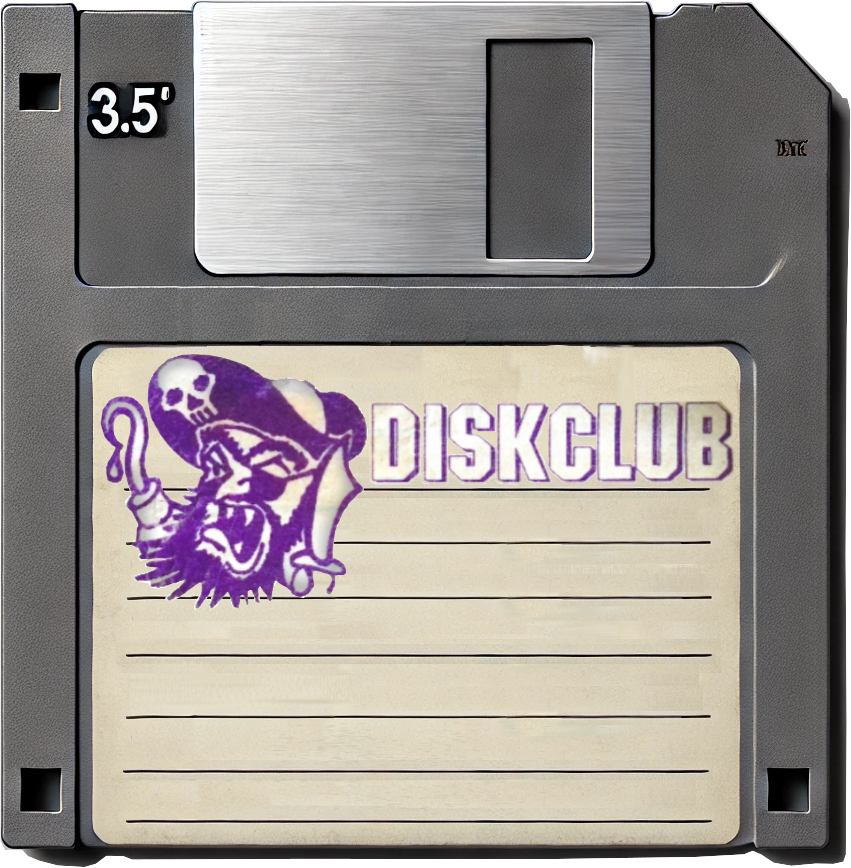

# Diskclub

This is an old Brazilian company which distributes games and softwares on
diskettes in a computer magazine.

Here I'm adding the original stamp I've found in one of my old 5¼-inch diskettes.

You'll find the original scanned file in the [original directory](original)

#### Artwork

All artwork was created with [inkscape](https://inkscape.org/) artwork files
will always be available as `.svg` in the [art directory](art). In additional
some `.xcf` files are also available to be used with [GIMP](https://gimp.org).

Some scanned versions can also be found in the [art directory](art).

- Here are some of the artwork files, and what's used for:

- [art/disk-clube-pirate-extracted.jpg](art/disk-clube-pirate-extracted.jpg) -
  The original pirate extracted from the original scanned version
- [art/diskclub.svg](art/diskclub.svg) - All artwork with tracemaps versions
- [art/bitmap-traced-pirate.svg](art/bitmap-traced-pirate.svg) - The pirated
  bitmap traced in inkscape
- [art/bitmap-traced-smooth-pirate.svg](art/bitmap-traced-smooth-pirate.svg) -
  The pirated with a smooth bitmap trace without modifications
- [art/bitmap-traced-smooth-pirate-1.svg](art/bitmap-traced-smooth-pirate-1.svg)
  - The smooth copy of the pirated but with a few modifications in the cartoon
- [fdd312/grey-floppy-layered-diskclub.xcf](fdd312/grey-floppy-layered-diskclub.xcf) - A 3½ floppy image with the diskclub images

#### 5¼-inch diskettes

For 5¼ diskettes the original diskclub stamp is provided without any changes.

#### 3½-inch floppy disks

For those floppy's I've recreated a label, to be printed or modified.
Those can be found in the [directory fdd3½](fdd312).

**Versions**

- Label where the pirate is closest to the original used only a bitmap
  trace

_the `svg` version of this file is
[fdd312/diskclub-fdd312-bitmap-pirate.svg](fdd312/diskclub-fdd312-bitmap-pirate.svg)_

- Label with a smooth traced pirate logo

_the `svg` version of this file is [fdd312/diskclub-fdd312-smooth-pirate.svg](./fdd312/diskclub-fdd312-smooth-pirate.svg)_

- Label with a smooth traced pirate logo in black

_the `svg` version of this file is [fdd312/diskclub-label-smooth-pirate-black.svg](./fdd312/diskclub-label-smooth-pirate-black.svg)_

- All the above label versions were joined in a single file for easinees editing  
  The merged version can be found in the file
  [fdd312/diskclub-fdd312-all.svg](fdd312/diskclub-fdd312-all.svg)

- The file
  [fdd312/grey-floppy-layered-diskclub.xcf](fdd312/grey-floppy-layered-diskclub.xcf)
  contains the [GIMP](https://www.gimp.org/downloads/) `.XCF` version of a 3½-inch floppy
  using an old-label with the Pirate and Diskblub logo. This `.XCF` file is
  layered witch allows to easly change the images in the label, using the same
  floppy image.  
    
  _the `.xcf`version of this file is [fdd312/grey-floppy-layered-diskclub.xcf](fdd312/grey-floppy-layered-diskclub.xcf)_

#### Fonts

The closest font I've found for the `DISKCLUB` is
[Blockletter](https://www.1001fonts.com/blockletter-font.html), you'll find a
copy in the [fonts](fonts) directory.

_please if you know a better alternative or which is the `DISKCLUB` font, please
open an issue, and we can work on that_

- [Blockletter Font](fonts/Blockletter.otf)

#### Contributing

Please follow the [Contributing](../../README.md#Contributing) guide in the main
[README](../../README.md).
