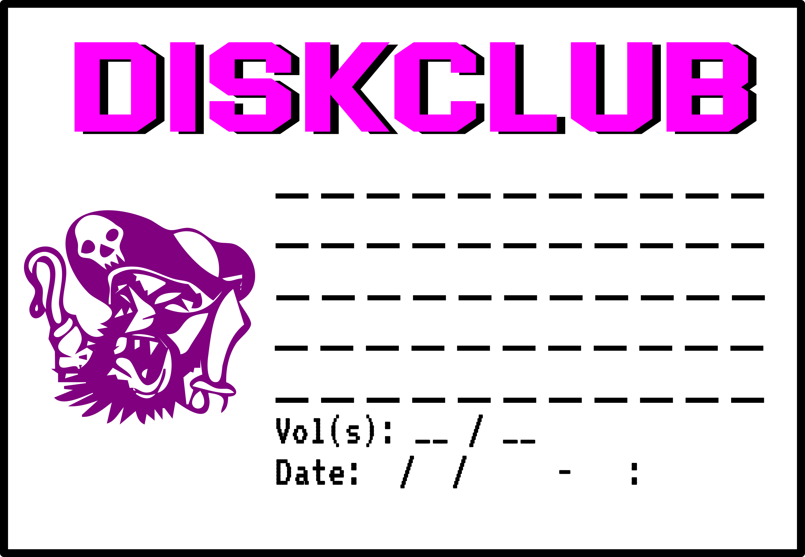
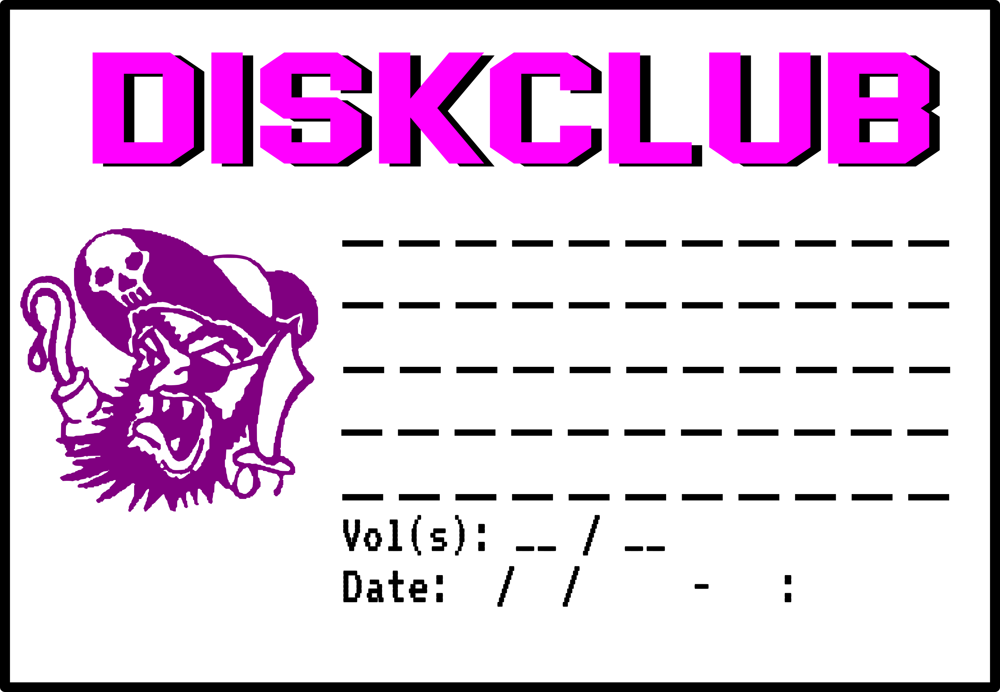
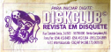

# Diskclub

This is an old Brazilian company which distributes games and softwares on
diskettes in a computer magazine.

Here I'm adding the original stamp I've found in one of my old 5¼-inch diskettes.

You'll find the original scanned file in the [original directory](original)

## Image Gallery

This section provides a comprehensive overview of all available diskclub images organized in tables for easy exploration. Each table shows the diskette type, image preview, format, description, and pixel dimensions.

### 3½-inch Floppy Disk Labels (fdd312)

| Diskette Type | Preview | Image | Format | Description | Dimensions |
|---------------|---------|-------|--------|-------------|------------|
| 3½" |  | [diskclub-fdd312-all.svg](fdd312/diskclub-fdd312-all.svg) | SVG | Complete diskclub label with all elements | 3094×2143 |
| 3½" |  | [diskclub-label-smooth-pirate-black.svg](fdd312/diskclub-label-smooth-pirate-black.svg) | SVG | Smooth pirate design with black background | 3094×2143 |
| 3½" |  | [diskclub-fdd312-smooth-pirate.svg](fdd312/diskclub-fdd312-smooth-pirate.svg) | SVG | Smooth pirate design variant | 3094×2143 |
| 3½" |  | [diskclub-fdd312-bitmap-pirate.svg](fdd312/diskclub-fdd312-bitmap-pirate.svg) | SVG | Bitmap-style pirate design | 3094×2143 |
| 3½" |  | [diskclub-tests.svg](fdd312/diskclub-tests.svg) | SVG | Test version of diskclub label | 794×1123 |
| 3½" |  | [grey-floppy-layered-diskclub.png](fdd312/grey-floppy-layered-diskclub.png) | PNG | Layered design on grey floppy background | 851×868 |
| 3½" |  | [diskclub-smooth-pirate.png](fdd312/diskclub-smooth-pirate.png) | PNG | Smooth pirate design raster version | 3094×2143 |
| 3½" |  | [diskclub-bitmap-pirate.png](fdd312/diskclub-bitmap-pirate.png) | PNG | Bitmap pirate design raster version | 3094×2143 |

### 5¼-inch Floppy Disk Labels (fdd514)

| Diskette Type | Preview | Image | Format | Description | Dimensions |
|---------------|---------|-------|--------|-------------|------------|
| 5¼" |  | [diskclub-original.png](original/diskclub-original.png) | PNG | Original diskclub scan | 478×226 |
| 5¼" |  | [diskclub-original.svg](original/diskclub-original.svg) | SVG | Original diskclub vector version | 478×226 |

### Artwork Source Files

#### Vector Artwork (SVG)

| Diskette Type | Preview | Image | Format | Description | Dimensions |
|---------------|---------|-------|--------|-------------|------------|
| 3½" |  | [bitmap-traced-pirate.svg](art/bitmap-traced-pirate.svg) | SVG | Traced pirate bitmap artwork | 921×879 |
| 3½" |  | [bitmap-traced-smooth-pirate.svg](art/bitmap-traced-smooth-pirate.svg) | SVG | Smooth traced pirate artwork | 888×824 |
| 3½" |  | [bitmap-traced-smooth-pirate-1.svg](art/bitmap-traced-smooth-pirate-1.svg) | SVG | Smooth traced pirate artwork variant | 888×824 |
| 3½" |  | [diskclub.svg](art/diskclub.svg) | SVG | Main diskclub logo artwork | 904×1136 |
| 3½" |  | [disk-clube-pirate-extracted.jpg](art/disk-clube-pirate-extracted.jpg) | JPEG | Extracted pirate element | 1280×1263 |

#### Source Files (XCF)

| Diskette Type | Preview | Image | Format | Description | Dimensions |
|---------------|---------|-------|--------|-------------|------------|
| 3½" |  | [grey-floppy-layered-diskclub.xcf](fdd312/grey-floppy-layered-diskclub.xcf) | XCF | GIMP source file for layered design | 851×868 |

### Fonts

| Font File | Format | Description |
|-----------|--------|-------------|
| [Blockletter.otf](fonts/Blockletter.otf) | OTF | Block letter font used in diskclub labels |

### Legend

- **Diskette Type**: 3½" (3.5-inch) or 5¼" (5.25-inch) floppy disk format
- **Preview**: Thumbnail preview of the image
- **Image**: Clickable link to view/download the image
- **Format**: File format (SVG, PNG, JPEG, XCF, OTF)
- **Description**: Brief description of the image content
- **Dimensions**: Image size in pixels (width × height)

### Notes

- **SVG files** are vector graphics suitable for scaling and editing
- **PNG/JPEG files** are raster images ready for printing
- **XCF files** are GIMP source files for editing
- **OTF files** are OpenType fonts used in the designs
- All images are organized by diskette type for easy navigation
- Image previews are automatically scaled by the browser for optimal viewing

## Original Documentation

#### Artwork

All artwork was created with [inkscape](https://inkscape.org/) artwork files
will always be available as `.svg` in the [art directory](art). In additional
some `.xcf` files are also available to be used with [GIMP](https://gimp.org).

Some scanned versions can also be found in the [art directory](art).

- Here are some of the artwork files, and what's used for:

- [art/disk-clube-pirate-extracted.jpg](art/disk-clube-pirate-extracted.jpg) -
  The original pirate extracted from the original scanned version
- [art/diskclub.svg](art/diskclub.svg) - All artwork with tracemaps versions
- [art/bitmap-traced-pirate.svg](art/bitmap-traced-pirate.svg) - The pirated
  bitmap traced in inkscape
- [art/bitmap-traced-smooth-pirate.svg](art/bitmap-traced-smooth-pirate.svg) -
  The pirated with a smooth bitmap trace without modifications
- [art/bitmap-traced-smooth-pirate-1.svg](art/bitmap-traced-smooth-pirate-1.svg)
  - The smooth copy of the pirated but with a few modifications in the cartoon
- [fdd312/grey-floppy-layered-diskclub.xcf](fdd312/grey-floppy-layered-diskclub.xcf) - A 3½ floppy image with the diskclub images

#### 5¼-inch diskettes

For 5¼ diskettes the original diskclub stamp is provided without any changes.

#### 3½-inch floppy disks

For those floppy's I've recreated a label, to be printed or modified.
Those can be found in the [directory fdd3½](fdd312).

**Versions**

- Label where the pirate is closest to the original used only a bitmap
  trace

_the `svg` version of this file is
[fdd312/diskclub-fdd312-bitmap-pirate.svg](fdd312/diskclub-fdd312-bitmap-pirate.svg)_

- Label with a smooth traced pirate logo

_the `svg` version of this file is [fdd312/diskclub-fdd312-smooth-pirate.svg](./fdd312/diskclub-fdd312-smooth-pirate.svg)_

- Label with a smooth traced pirate logo in black

_the `svg` version of this file is [fdd312/diskclub-label-smooth-pirate-black.svg](./fdd312/diskclub-label-smooth-pirate-black.svg)_

- All the above label versions were joined in a single file for easinees editing  
  The merged version can be found in the file
  [fdd312/diskclub-fdd312-all.svg](fdd312/diskclub-fdd312-all.svg)

- The file
  [fdd312/grey-floppy-layered-diskclub.xcf](fdd312/grey-floppy-layered-diskclub.xcf)
  contains the [GIMP](https://www.gimp.org/downloads/) `.XCF` version of a 3½-inch floppy
  using an old-label with the Pirate and Diskblub logo. This `.XCF` file is
  layered witch allows to easly change the images in the label, using the same
  floppy image.  
    
  _the `.xcf`version of this file is [fdd312/grey-floppy-layered-diskclub.xcf](fdd312/grey-floppy-layered-diskclub.xcf)_

#### Fonts

The closest font I've found for the `DISKCLUB` is
[Blockletter](https://www.1001fonts.com/blockletter-font.html), you'll find a
copy in the [fonts](fonts) directory.

_please if you know a better alternative or which is the `DISKCLUB` font, please
open an issue, and we can work on that_

- [Blockletter Font](fonts/Blockletter.otf)

#### Contributing

Please follow the [Contributing](../../README.md#Contributing) guide in the main
[README](../../README.md).
