# Hack The Planet!

[]

I was wondering to have some cool stickers and fabric patches with some cool
floppy disk logos. So I've started to created those floppy images with the
iconic phrase "Hack The Planet!" on it.

I couldn't decide which one was better, so I'm saving here all versions I've
created with DALL-E model.

Several I edited on [GIMP](https://gimp.org), and split the images on layers so
you can combine or change the skull's or mix everything in the way you want.

Here's all the work I have so far with those images. You will find several
versions, some differs slightly from the other, some are completely different.

Go ahead and explore, I'm using mostly for stickers, t-shirts, and fabric
patches in my backpacks.

#### Artwork

All artwork was created with [inkscape](https://inkscape.org/) artwork files
will always be available as `.svg` in the [art directory](art). In additional
some `.xcf` files are also available to be used with [GIMP](https://gimp.org).

Some scanned versions can also be found in the [art directory](art).

- Here are some of the artwork files, and what's used for:

- [art/htp-pirate-purple.svg](art/htp-pirate-purple.svg) - The "Hack The
  Planet!" purple pirate is a concept of an artwork that can be used in
  diskette labels.
  You will also find the [`xcf` GIMP](https://gimp.org) version for this artwork in
  [art/htp-purple-pirate.xcf](art/htp-purple-pirate.xcf)

- [art/htp-v1.0.xcf](art/htp-v1.0.xcf) - A grey diskettes with a pirate
  skull, all 1.x version were derivate from this image.
  The artwork contains a [`xcf` GIMP](https://gimp.org) version of this image.

- [art/htp-v2.0.xcf](art/htp-v2.0.xcf) - A black floppy with a pirate
  skull and the phrase "Hack The Planet", all 2.x versions were derivate from
  this image.
  The artwork contains a [`xcf` GIMP](https://gimp.org) version of this image.

- [art/htp-v3.0.xcf](art/htp-v3.0.xcf) - A rotate disk with a pirate and
  "Hack The Planet" phrase, all 3x versions were based on this image.
  The artwork contains a [`xcf` GIMP](https://gimp.org) version of this image.

- [art/htp-v4.0.xcf](art/htp-v4.0.xcf) - A grey floppy disk, front facing,
  with some windows 95 words and logos, all v4.x version were based on this
  image.
  The artwork contains a [`xcf` GIMP](https://gimp.org) version of this image.

- [art/htp-v8.0.xcf](art/htp-v8.0.xcf) - Front facing skull in a black
  diskette, a nice "Hack The Planet" font is being used here, all v8.x version
  were based in this image.
  The artwork contains a [`xcf` GIMP](https://gimp.org) version of this image.

- [art/htp-v9.0.xcf](art/htp-v9.0.xcf) - Front facing skull in a grey
  diskette, the skull is using a burrow, and there's a "Hack The Planet!" phrase
  in the bottom of the label. All v9.x version were based in this image.
  This is a mixed version using the 3.0 label with the 6.0 skull burrow.
  The artwork contains a [`xcf` GIMP](https://gimp.org) version of this image.

#### 5¼-inch diskettes

- TBD

#### 3½-inch floppy disks

For those floppy's I've recreated a label, to be printed or modified.
Those can be found in the [directory fdd3½](fdd312).

**Versions**

- v1.0:

[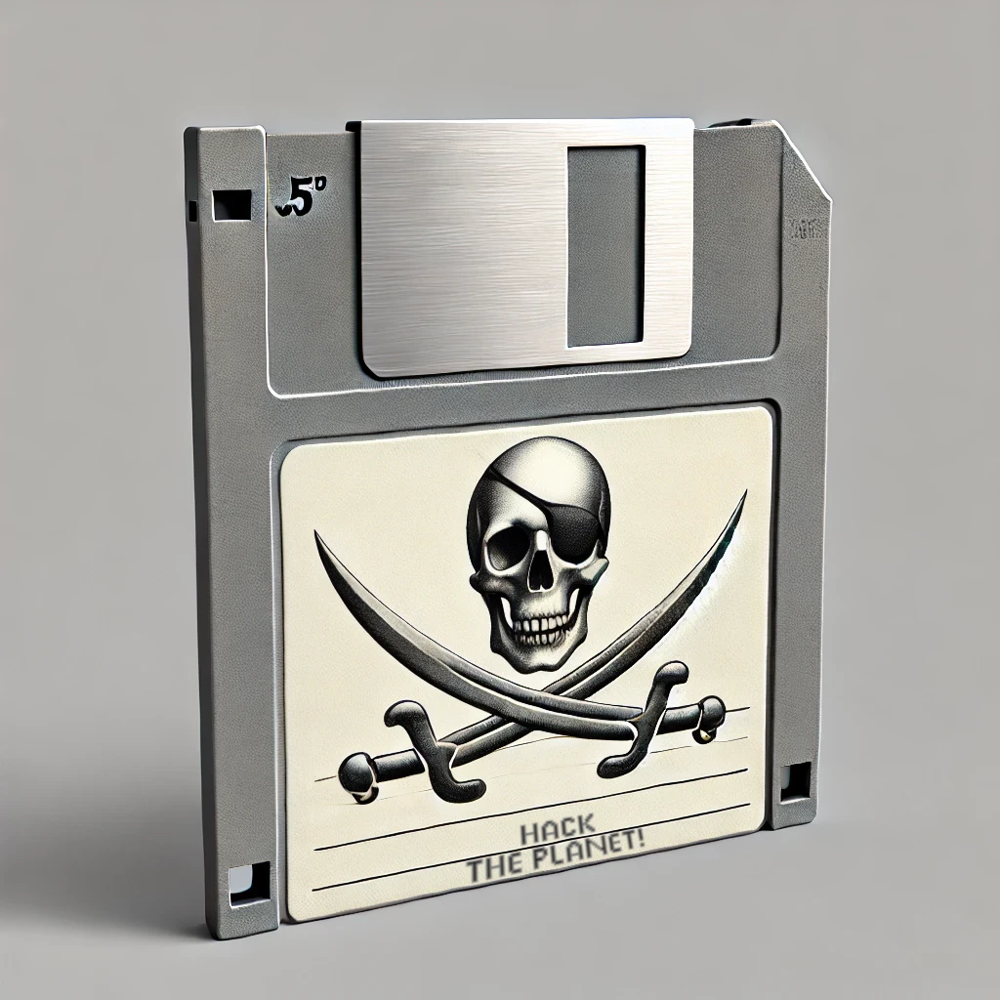](fdd312/htp-v1.0.webp)
_the `xcf` version of this file is
[art/htp-v1.0.xcf](art/htp-v1.0.xcf)_

- v2.0:

[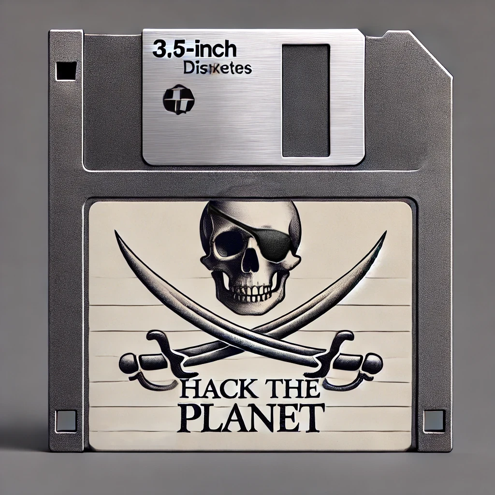](fdd312/htp-v2.0.webp)
_the `xcf` version of this file is
[art/htp-v2.0.xcf](art/htp-v2.0.xcf)_

- v3.0:

[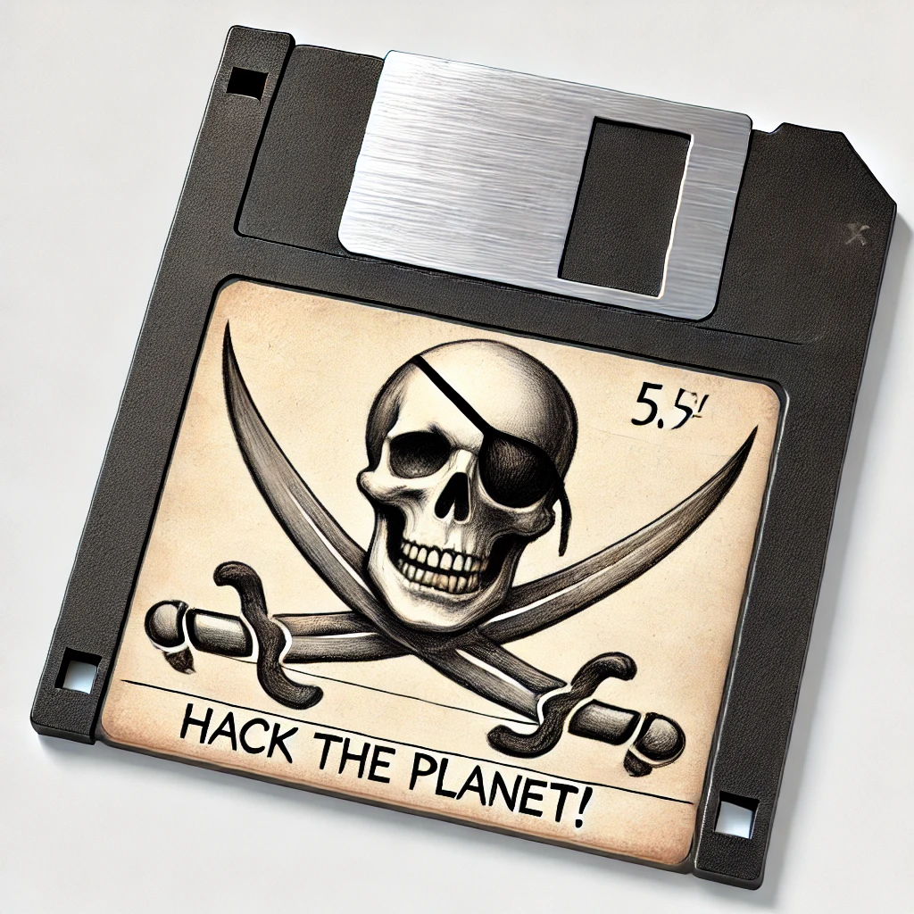](fdd312/htp-v3.0.webp)  
_the `xcf` version of this file is
[art/htp-v3.0.xcf](art/htp-v3.0.xcf)_

- v4.0:

[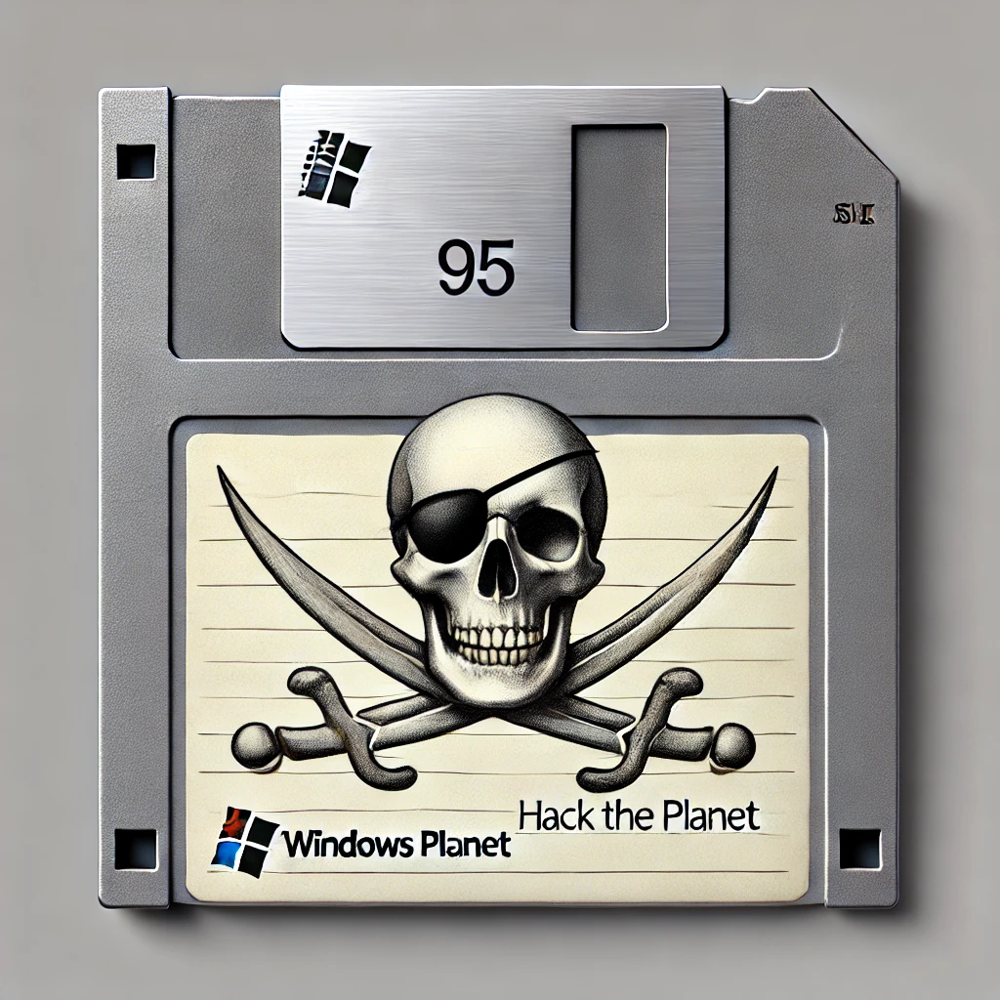](fdd312/htp-v4.0.webp)  
_the `xcf` version of this file is
[art/htp-v4.0.xcf](art/htp-v4.0.xcf)_

- v5.0:

[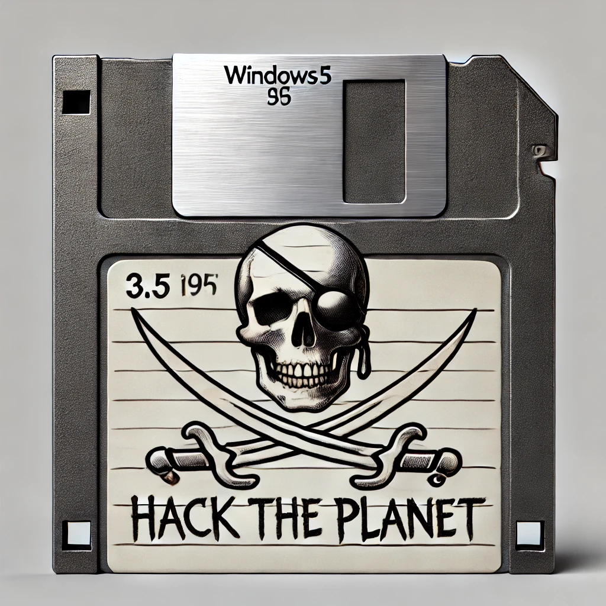](fdd312/htp-v5.0.webp)

- v6.0:

[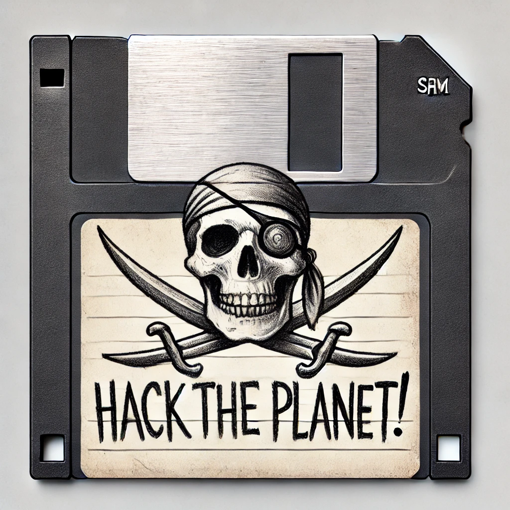](fdd312/htp-v6.0.webp)

- v7.0:

[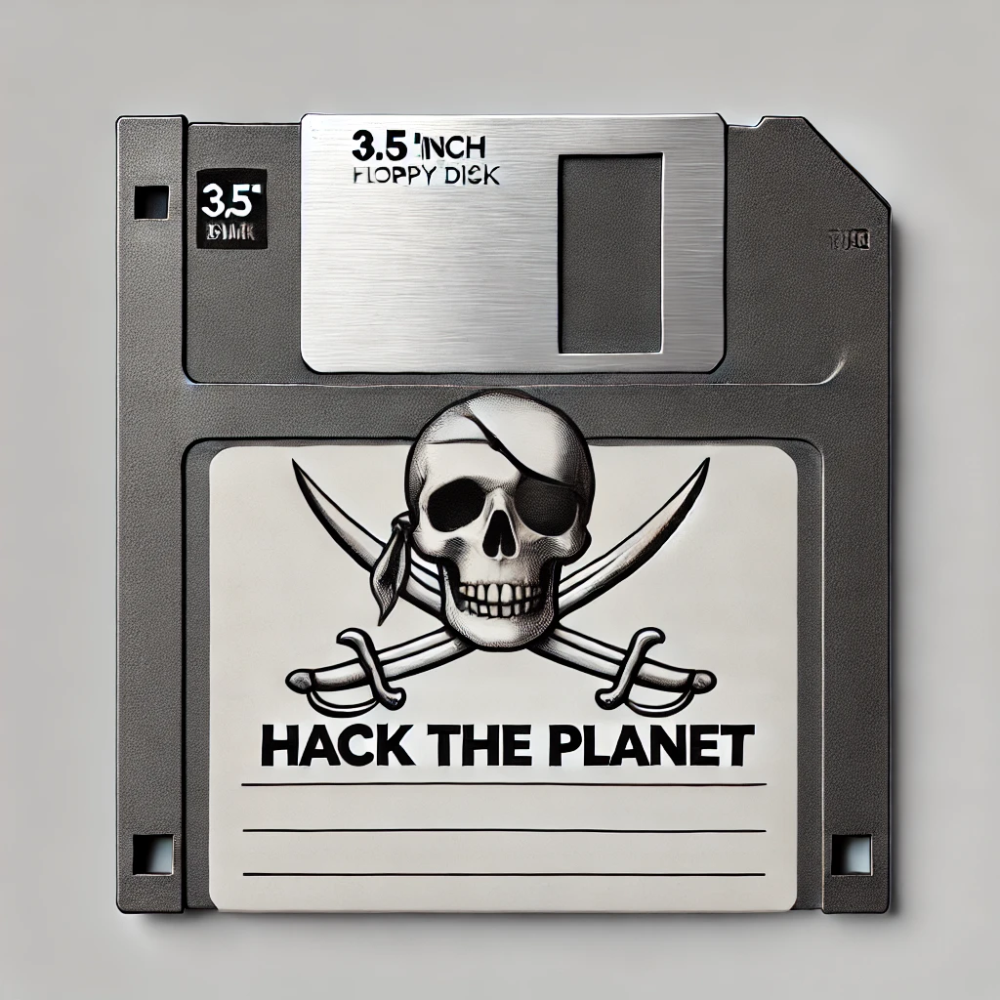](fdd312/htp-v7.0.webp)

- v8.0:

[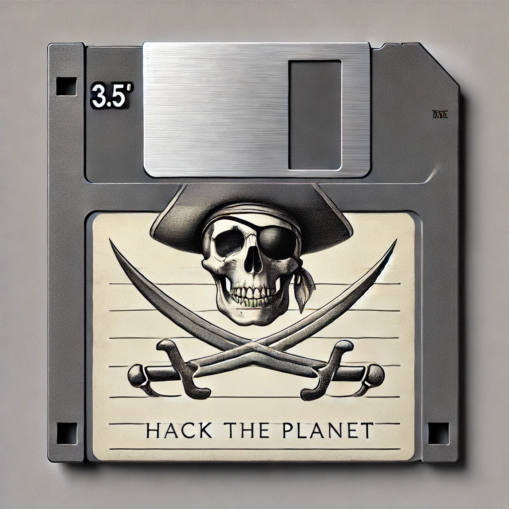](fdd312/htp-v8.0.webp)  
_the `xcf` version of this file is
[art/htp-v8.0.xcf](art/htp-v8.0.xcf)_

- v9.0:

[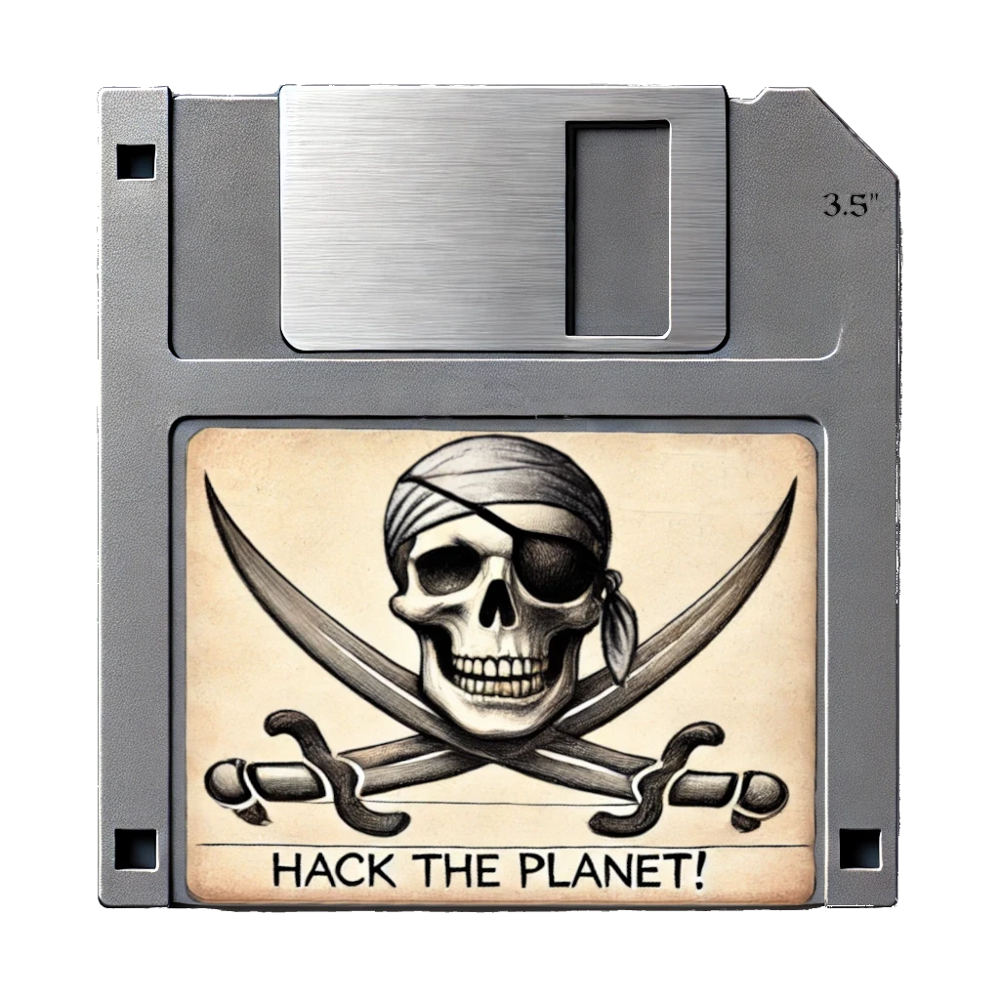](fdd312/htp-v9.0.webp)  
_the `xcf` version of this file is
[art/htp-v9.0.xcf](art/htp-v9.0.xcf)_

- The Purple Pirate:

[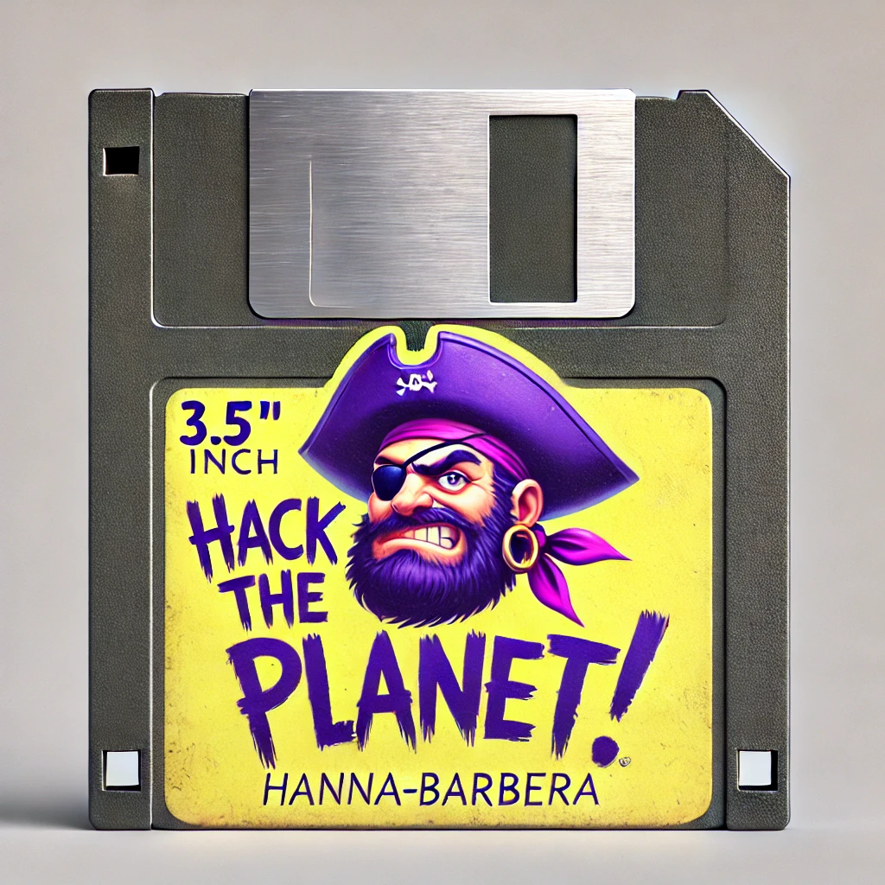](fdd312/htp-purple-pirate.webp)  
_this is a conceptual floppy label with a purple pirate instead of a skull in
the "Hack The Planet!" label series._

- The Purple Pirate Artwork:

[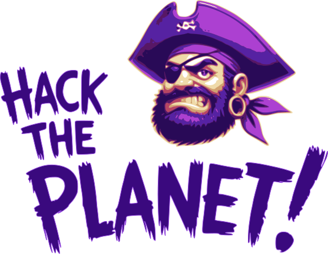](art/htp-pirate-purple.svg)  
_this artwork converts to vector image the pirate purple, so it can be used in
other labels, the `svg` version of this file is
[art/htp-pirate-purple.svg](art/htp-pirate-purple.svg) and the `xcf` GIMP
version can find in [art/htp-purple-pirate.xcf](art/htp-purple-pirate.xcf)_

#### Fonts

- None

#### Contributing

Please follow the [Contributing](../../README.md#Contributing) guide in the main
[README](../../README.md).
