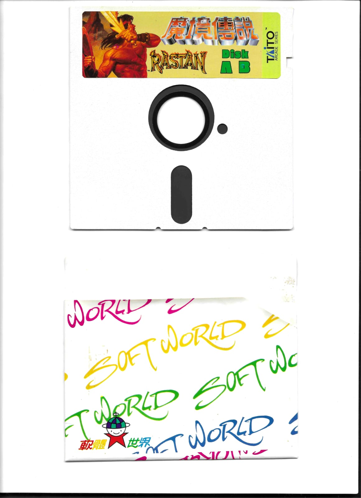
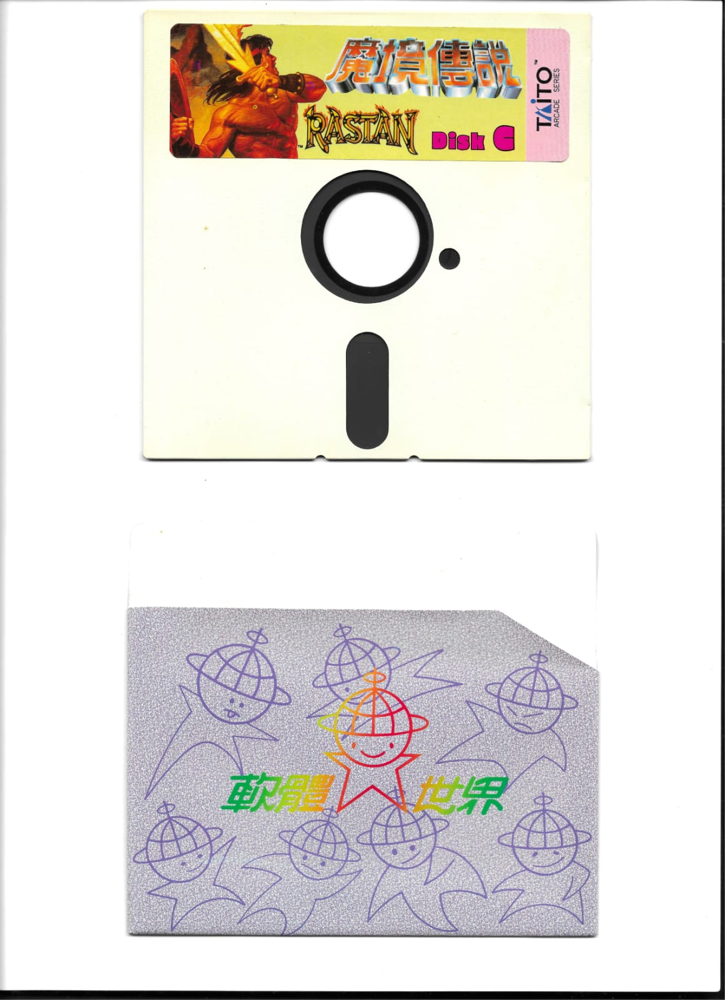
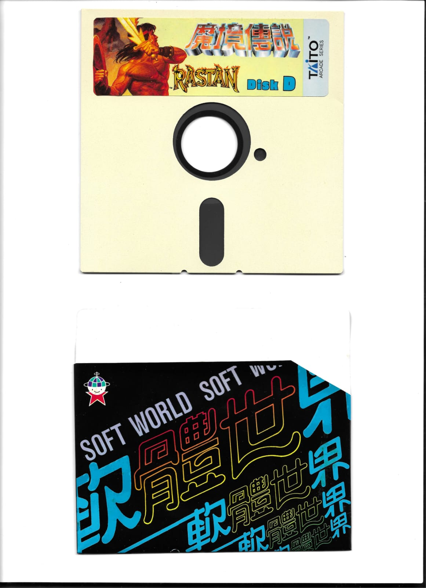

# Rastan

This is a collection of floppy disk labels for the classic arcade game **Rastan** (known as **Rastan Saga** in Japan), created by Taito in 1987.

## About Rastan

Rastan is a side-scrolling hack and slash arcade video game that was a critical and commercial success. The game follows the story of Rastan, a barbaric warrior who embarks on a quest to save the kingdom of Ceim from monsters in exchange for rich rewards. The game features six rounds with challenging bosses including King Graton, King Slay, Symplegades, Laios, The Hydra, and ultimately The Dragon.

For more detailed information about the game, visit the [Rastan Wikipedia page](https://en.wikipedia.org/wiki/Rastan_(video_game)).

## Game Details

- **Developer**: Taito
- **Publisher**: Taito
- **Release Date**: March 1987 (Japan), April 1987 (Worldwide)
- **Genre**: Hack and slash, Platform game
- **Platform**: Arcade, with ports to various home systems
- **Original Format**: 5¼-inch floppy disk (Japanese release)

## Floppy Disk Labels

This collection contains scanned versions of the original 5¼-inch floppy disk labels used for the Japanese release of Rastan Saga. The labels are organized by disk sides (A/B, C, and D) as was common for multi-disk games of the era.

### 5¼-inch Floppy Disk Labels (fdd514)

The original Rastan Saga was distributed on 5¼-inch floppy disks in Japan. The labels feature the distinctive Taito branding and artwork characteristic of the late 1980s arcade-to-home conversions.

#### Available Label Scans

- **[rastan-disc-AB-scanned-version.jpg](fdd514/rastan-disc-AB-scanned-version.jpg)** - Scanned version of Disk A/B label
- **[rastan-disc-C-scanned-version.jpg](fdd514/rastan-disc-C-scanned-version.jpg)** - Scanned version of Disk C label  
- **[rastan-disc-D-scanned-version.jpg](fdd514/rastan-disc-D-scanned-version.jpg)** - Scanned version of Disk D label

### Original Scan Preview

_Thanks to Dan from the Brazilian Retro Computer WhatsApp group for providing the scans_

## Historical Context

Rastan represents an important era in gaming history when arcade games were being ported to home computers. The 5¼-inch floppy disk format was the standard for Japanese PC gaming in the late 1980s, and Taito's careful attention to packaging and labeling helped establish the game's premium feel.

The multi-disk format (A/B, C, D) was necessary due to the game's size and complexity, with each disk containing different levels and assets. This distribution method was common for Japanese PC games of the period, especially those converted from arcade machines.

## Printing Instructions

To recreate these labels for your own 5¼-inch floppy disks:

1. **Paper Type**: Use high-quality adhesive label paper designed for floppy disks
2. **Print Settings**: Print at 300 DPI or higher for best quality
3. **Size**: Ensure the label fits the standard 5¼-inch floppy disk label area
4. **Application**: Carefully align and apply the label to avoid air bubbles

## Contributing

Please follow the [Contributing](../../README.md#Contributing) guide in the main [README](../../README.md).

If you have additional Rastan-related labels, artwork, or historical materials, please consider contributing them to this collection.

## References

- [Rastan (video game) - Wikipedia](https://en.wikipedia.org/wiki/Rastan_(video_game))
- [Taito Corporation](https://en.wikipedia.org/wiki/Taito)
- [5¼-inch floppy disk](https://en.wikipedia.org/wiki/Floppy_disk#5%C2%BC-inch_disk)

---

*This collection preserves the original artwork and labeling from the Japanese release of Rastan Saga, maintaining the historical accuracy and visual appeal of Taito's classic arcade-to-home conversion.* 